  

  
  
  

  <a href="#tech-stack">Tech Stack</a> |
  <a href="#currently">Currently</a> |
  <a href="#github-pulse">GitHub Pulse</a> |
  <a href="#connect">Connect</a>

  

### Snapshot

<table>
  <tr>
    <td width="50%">
      <h3>What I enjoy building</h3>
      

        I like turning messy ideas into calm, useful software: sharp interfaces,
        practical automation, and developer experiences that feel smooth from the first click.
      

    </td>
    <td width="50%">
      <h3>How I work</h3>
      

        I care about readable code, clear architecture, fast feedback loops,
        and small details that make a product feel alive.
      

    </td>
  </tr>
</table>

### Tech Stack

  

### Currently

<table id="currently">
  <tr>
    <td width="33%">
      <b>Learning</b> 
      Better product thinking, animation polish, and AI-assisted workflows.
    </td>
    <td width="33%">
      <b>Building</b> 
      Interfaces, utilities, automations, and small tools that remove friction.
    </td>
    <td width="33%">
      <b>Improving</b> 
      Performance, accessibility, testing habits, and clean release routines.
    </td>
  </tr>
</table>

### GitHub Pulse

  
  

  

### Contribution Flow

  

### Connect

  
  
  

  
    Designed to feel fast, warm, and alive. Update the links and username once, then let the animations do the rest.
  

<!--
Quick personalization checklist:
- Replace every "Kadir" in badge/stat URLs with your exact GitHub username if it is different.
- Add LinkedIn, X, portfolio, or mail links if you want public contact buttons.
- Edit the Tech Stack icons at https://skillicons.dev if you want a different set.
- The workflow in .github/workflows/profile-animations.yml refreshes assets/snake.svg automatically on GitHub.
-->
